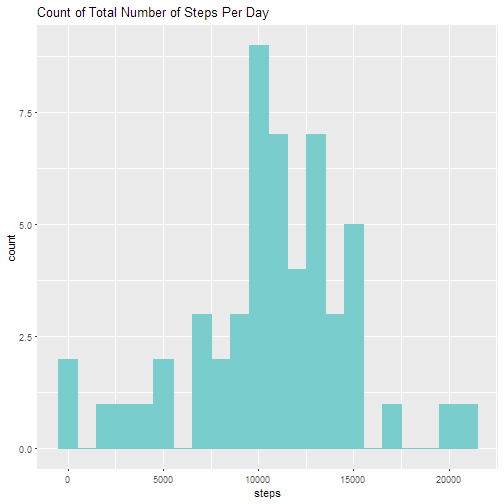
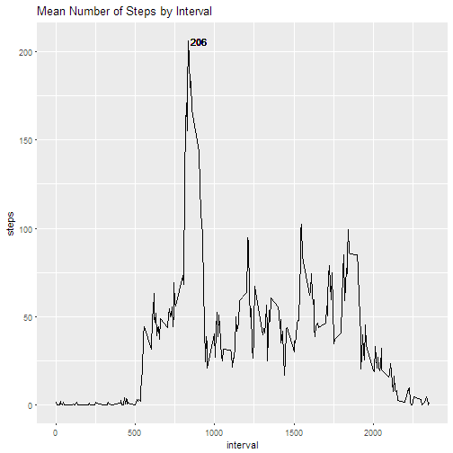
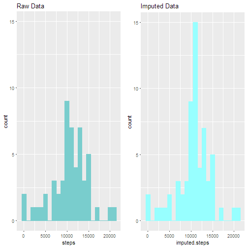
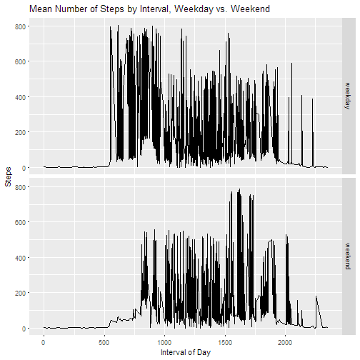

## R Markdown

This is an R Markdown document. Markdown is a simple formatting syntax for authoring HTML, PDF, and MS Word documents. For more details on using R Markdown see <http://rmarkdown.rstudio.com>.

When you click the **Knit** button a document will be generated that includes both content as well as the output of any embedded R code chunks within the document. You can embed an R code chunk like this:


```r
## load necessary packages
library(ggplot2)
library(gridExtra)
library(dplyr)
library(knitr)

## download data and read it into R
download.file("https://d396qusza40orc.cloudfront.net/repdata%2Fdata%2Factivity.zip",
              "monitor.zip")

monitor <- read.csv(unzip("monitor.zip"), 
                    na.strings = "NA", 
                    stringsAsFactors = FALSE)

## convert date column to date data type
monitor$date <- as.Date(monitor$date)
```

## What is mean total number of steps taken per day?

```r
### what is the mean total number of steps taken per day?
## aggregate total steps by date
by.date <- aggregate(monitor$steps,
                     by  = list(
                           Date = monitor$date),
                     FUN = sum)
names(by.date) <- c("date", 
                    "steps")
```

Calculate the total number of steps taken per day.

```r
## calculate total number of steps taken per day
sum(by.date$steps,
    na.rm = TRUE)
```

```
## [1] 570608
```

Make a histogram of the total number of steps taken each day.

```r
## plot total steps taken per day
qplot(steps, 
      geom     = "histogram",
      data     = by.date, 
      main     = "Count of Total Number of Steps Per Day",
      col      = I("darkslategray3"),
      fill     = I("darkslategray3"),
      binwidth = 1000)
```

```
## Warning: Removed 8 rows containing non-finite values (stat_bin).
```



Calculate and report the mean and median of the total number of steps taken per day.

```r
## calculate mean and median of steps 
## taken per day
mean(by.date$steps, 
     na.rm = TRUE)
```

```
## [1] 10766.19
```

```r
median(by.date$steps, 
       na.rm = TRUE)
```

```
## [1] 10765
```

##What is the average daily pattern?

Preparation of dataset occurs below

```r
## remove NAs, create a subset data frame and name the resulting columns
by.interval <- subset(monitor, 
                      !is.na(monitor$steps))

by.interval <- aggregate(by.interval$steps,
                         by  = list(
                               Interval = by.interval$interval),
                         FUN = mean)
names(by.interval) <- c("interval",
                        "steps")
by.interval$interval <- as.numeric(by.interval$interval)
```

Which 5-minute interval, on average across all the days in the dataset, contains the maximum number of steps?

```r
max.steps <- subset(by.interval, steps == max(steps))
```

Make a time series plot (i.e. type = "l") of the 5-minute interval (x-axis) and the average number of steps taken, averaged across all days (y-axis)

```r
## plot and label resulting data, moving the 
## x axis of the max label for readability
ggplot(data = by.interval,
       aes(x     = interval,
           y     = steps,
           group = 1)) + 
  geom_line() + 
  ggtitle("Mean Number of Steps by Interval") + 
  geom_text(data = NULL,
            aes(x     = 900,
                y     = 206,
                label = "206"))
```



##Imputing missing values
Calculate and report the total number of missing values in the dataset (i.e. the total number of rows with NAs)

```r
sum(is.na(monitor$steps))
```

```
## [1] 2304
```

Devise a strategy for filling in all of the missing values in the dataset. The strategy does not need to be sophisticated. For example, you could use the mean/median for that day, or the mean for that 5-minute interval, etc.

Create a new dataset that is equal to the original dataset but with the missing data filled in.

```r
## join means and raw monitor data into a new table
imp.monitor <- left_join(monitor, by.interval, by = "interval")

## loop through table and, for each observation, assign observation 
## value if it exists, else, assign mean to missing values
for(i in seq(imp.monitor$steps.x)) {
  ifelse(is.na(imp.monitor$steps.x[i]),
         imp.monitor$impute[i] <- imp.monitor$steps.y[i],
         imp.monitor$impute[i] <- imp.monitor$steps.x[i])
}

imp.date <- aggregate(imp.monitor$impute,
                      by  = list(
                            Date = imp.monitor$date),
                      FUN = sum)
names(imp.date) <- c("date",
                     "imputed.steps")
```

Make a histogram of the total number of steps taken each day and Calculate and report the mean and median total number of steps taken per day. Do these values differ from the estimates from the first part of the assignment? What is the impact of imputing missing data on the estimates of the total daily number of steps?


```r
## create histogram of original data and compare 
## it to a histogram of imputed data
pl1 <- qplot(steps, 
             geom     = "histogram",
             data     = by.date, 
             main     = "Raw Data",
             col      = I("darkslategray3"),
             fill     = I("darkslategray3"),
             binwidth = 1000) + 
             ylim(0, 15)

pl2 <- qplot(imputed.steps, 
             geom     = "histogram",
             data     = imp.date, 
             main     = "Imputed Data",
             col      = I("darkslategray1"),
             fill     = I("darkslategray1"),
             binwidth = 1000) + 
             ylim(0, 15)

grid.arrange(pl1, pl2, ncol = 2)
```

```
## Warning: Removed 8 rows containing non-finite values (stat_bin).
```



```r
## calculate mean and median of total number of steps taken per day (imputed)
mean(imp.date$imputed.steps)
```

```
## [1] 10766.19
```

```r
median(imp.date$imputed.steps)
```

```
## [1] 10766.19
```

##Are there differences in activity patterns between weekdays and weekends?
Create a new factor variable in the dataset with two levels - "weekday" and "weekend" indicating whether a given date is a weekday or weekend day.


```r
## develop weekday column
imp.monitor$weekday <- weekdays(imp.monitor$date)
imp.monitor$weekday[imp.monitor$weekday == "Saturday" | 
                    imp.monitor$weekday == "Sunday"] <- "weekend"
imp.monitor$weekday[!imp.monitor$weekday == "weekend"] <- "weekday"
imp.monitor$weekday <- as.factor(imp.monitor$weekday)
```

Make a panel plot containing a time series plot (i.e. type = "l") of the 5-minute interval (x-axis) and the average number of steps taken, averaged across all weekday days or weekend days (y-axis). 

```r
## generate dataset for plotting averages by weekday and weekend
weekplot <- aggregate(interval ~ impute + weekday, data = imp.monitor, mean)

## generate plot
ggplot(weekplot, aes(interval,
                     impute)) + 
       geom_line() + 
       facet_grid(weekday ~ .) + 
       xlab("Interval of Day") + 
       ylab("Steps") +
       ggtitle("Mean Number of Steps by Interval, Weekday vs. Weekend")
```




